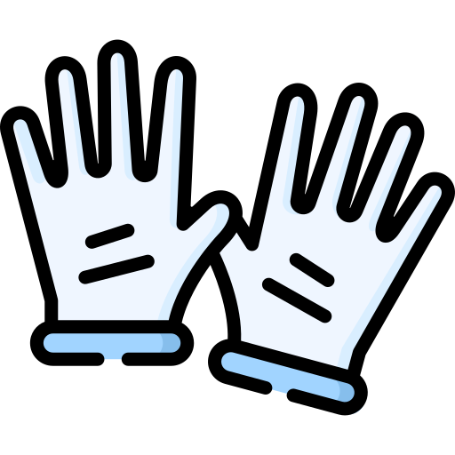

<!--CSS-->
<head>
  <link rel="stylesheet" href="https://cdn.jsdelivr.net/npm/@fortawesome/fontawesome-free/css/all.min.css">
</head>

## Hi &nbsp; [Harry](https://www.harrly.com)'s Here.

> Fresh Off the Boat. && Nice to meet you.

- Student. (Lifetime)
- Dev.

    

---

I am exploring everything.

---

To know more:

- [Wesbite](https://www.harrly.com)
- [Photo](https://photo.harrly.com)
- [About](https://blog.harrly.com/about)
- [Contact](mailto:hi@hiio.me)

---

Stay Save. 
 
Keep Distancing. 
 
Protect Yourself. 

---

Have a nice day! :)
