<head>
  <link rel="stylesheet" href="https://cdn.jsdelivr.net/npm/@fortawesome/fontawesome-free/css/all.min.css">
</head>

## Hi, [Harry](https://www.harrly.com) is here.

> Fresh off the Boat. && Nice to meet you.

- Student. (Lifetime)
- Dev.

---

I am ...

Using these techniques to explore the world:

...

Working with my friends:

...

---

| About | Me |
| - | - |
|  |  |

You can also find me here:

- [Wesbite](https://www.harrly.com)
- [Photo](https://photo.harrly.com)
- [About](https://blog.harrly.com/about)
- [Contact](mailto:hi@hiio.me)

---

Have a nice day! :)
